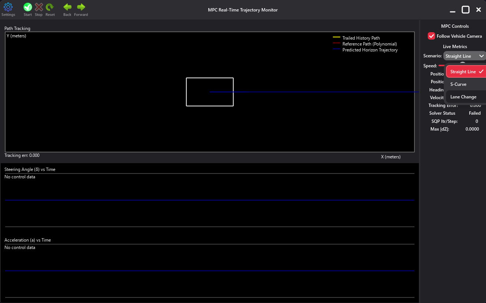
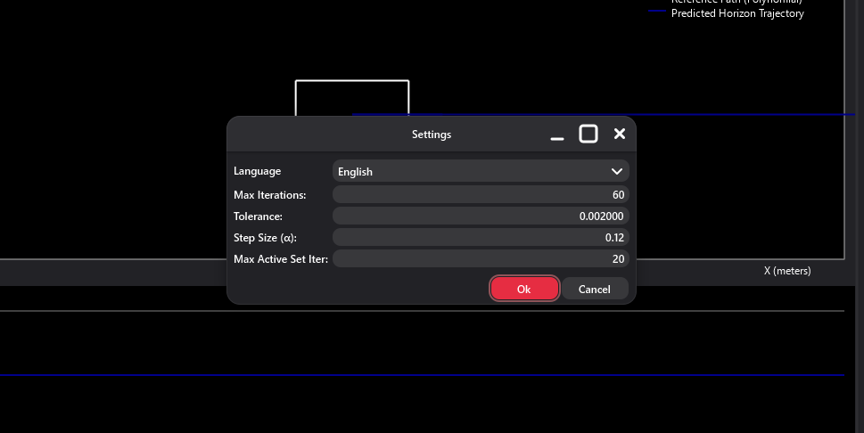
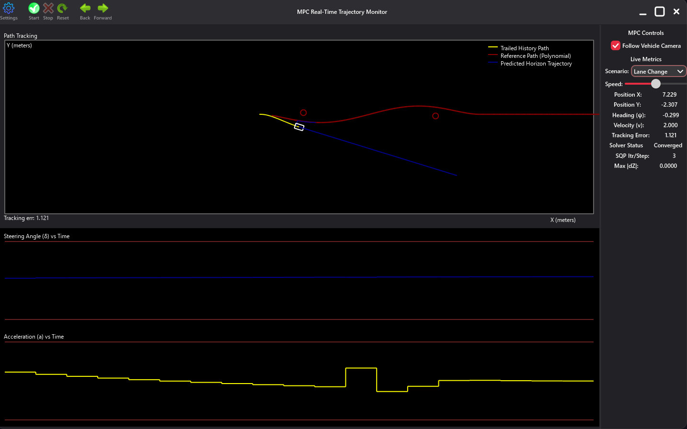
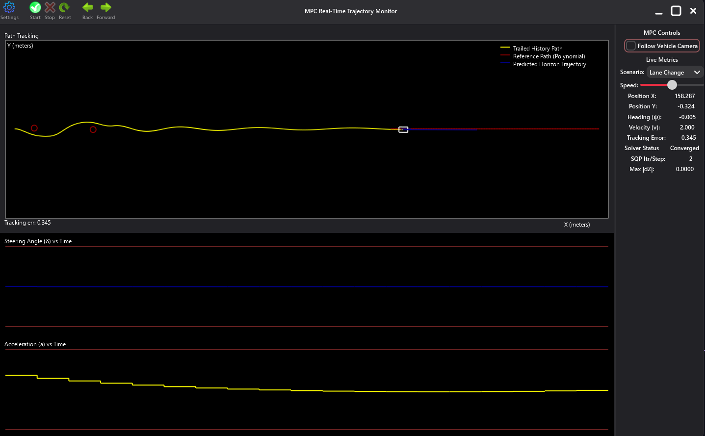

<div align="center">


# RobotTrajectoryOpt

**Real-time 2D robot trajectory optimization using Active-Set QP + Sequential Quadratic Programming (SQP), built with C++ and the natID framework.**

**Academic Project** • Numerical Optimization • Data Science and AI • ETF Sarajevo


</div>

## 📋 Table of Contents

- [Overview](#-overview)
- [How It Works](#-how-it-works)
- [What's New in v2.0](#-whats-new-in-v20)
- [Features](#-features)
- [Demo](#-demo)
- [Technologies](#%EF%B8%8F-technologies)
- [Prerequisites](#-prerequisites)
- [Installation](#-installation)
- [Building the Project](#-building-the-project)
- [Usage](#-usage)
- [Scenarios](#-scenarios)
- [Solver Architecture](#-solver-architecture)
- [Architecture](#%EF%B8%8F-architecture)
- [Project Structure](#project-structure)
- [Screenshots](#-screenshots)
- [Documentation](#-documentation)
- [Known Limitations](#-known-limitations)
- [Team](#-contributors)
- [Contributing](#-contributing)
- [License](#-license)
- [Contact](#-contact)

---

## 🎯 Overview

**RobotTrajectoryOpt** is a real-time trajectory-optimization application that plans and simulates the motion of a **2D mobile robot** (kinematic bicycle model) along smooth reference paths, using **Model Predictive Control (MPC)**. Instead of a grid-search planner like A*, the robot's path is treated as a continuous constrained optimization problem: at every control step, the solver computes the steering angle and acceleration that best track the reference path while respecting the vehicle's dynamics, actuator limits, velocity bounds, and obstacle avoidance constraints.

Built as the term project for the **Numerical Optimization** course at the Faculty of Electrical Engineering (ETF), University of Sarajevo, it directly applies quadratic programming, constrained optimization (active-set methods, KKT conditions), and sparse linear algebra covered in the course, and visualizes the result live using the **natID GUI framework**.

**Academic Context:**

- **Course:** Numerical Optimization
- **Professor:** Prof. Dr. Izudin Džafić
- **Academic Year:** 2025/26

---

## ⚙️ How It Works

At every simulation step, RobotTrajectoryOpt:

1. **Linearizes** the nonlinear bicycle-model dynamics around the current nominal trajectory.
2. **Builds explicit inequality constraint rows** for steering bounds (±0.6 rad), acceleration bounds (±3.0 m/s²), velocity bounds (0–3.0 m/s), and obstacle avoidance (linearized distance + slack non-negativity) inside the QP.
3. **Solves** the resulting constrained QP using a full **Active-Set QP solver** with warm-starting, Tikhonov regularization, and sparse indefinite **LDLᵀ** factorization at every inner iteration.
4. **Repeats** this linearize-and-solve loop (Sequential Quadratic Programming) until the step size converges or an iteration budget is reached.
5. **Applies only the first control pair** `(δ₀, a₀)` from the resulting N-step plan to the simulated vehicle, then re-solves from the new state — the classic MPC *receding horizon*.

Every steering and acceleration command shown in the GUI is the direct output of this optimization; there is no lookup table, PID controller, or pre-computed trajectory involved.

---

## 🆕 What's New in v2.0

| Change | v1.0 | v2.0 |
|--------|------|------|
| **QP Solver** | KKT saddle-point assembly + LDLᵀ | Full Active-Set QP with warm-starting, Tikhonov regularization, and dual tolerance |
| **Actuator Limits** | Post-hoc clamping after solve | Explicit inequality constraint rows in the QP |
| **Velocity Bounds** | Not enforced | $v \geq 0$ and $v \leq v_{\max}$ as QP inequality rows |
| **Obstacle Avoidance** | Slack-relaxed equality row | Proper linearized inequality constraint rows + slack non-negativity |
| **Warm-Start** | From previous solution | t=0 snap to vehicle telemetry + tag-based constraint matching |
| **Reference Generation** | Once at initialization | Fresh reference every step from vehicle's current position |
| **Stagnation Detection** | None | Resets nominal trajectory when SQP converges too quickly |
| **QP Failure Recovery** | None | Falls back to polynomial reference with feedforward controls |
| **Settings Dialog** | Max Iterations, Tolerance | + Step Size α, Max Active Set Iter (with 6-language support) |

---

## ✨ Features

### Core Simulation

- 🧮 **Genuine online optimization** — every control command comes from a live Active-Set QP solve, not a heuristic tracker
- 🚗 **Kinematic bicycle vehicle model** with configurable wheelbase, horizon length, and time step
- 📈 **Quintic polynomial reference paths** with matched initial/terminal slope to avoid heading-mismatch tracking offsets
- 🧱 **Obstacle-aware planning** via linearized inequality constraints with slack variables (not post-hoc clamping)
- 🔧 **Explicit actuator and velocity bounds** enforced as QP inequality rows (steering ±0.6 rad, acceleration ±3.0 m/s², velocity 0–3.0 m/s)
- 🔁 **Receding-horizon control** with warm-started SQP iterations for fast convergence
- ↩️ **Step history navigation** (Back/Forward) through previously computed simulation snapshots
- 🛡️ **Robustness mechanisms** — warm-start t=0 snap, fresh reference every step, stagnation detection, QP failure recovery, stale warm-start detection

### Visualization

- 🖥️ **Real-time path-tracking canvas** — reference path, driven history, and predicted horizon all drawn live
- 📊 **Steering and acceleration time-series plots** updated every step
- 🎥 **Follow-vehicle camera** toggle for auto-recentering the view
- 📟 **Live telemetry HUD** — position, heading, velocity, tracking error, solver status, iteration count, convergence metric

### Solver Tuning & Diagnostics

- ⚙️ **Configurable solver settings** — max SQP iterations, convergence tolerance, step size α, max active-set iterations
- 🌍 **6 UI languages** — English, Bosnian, German, Spanish, French, Japanese
- 🪵 **Timestamped simulation logs** — every step's full numerical state written to `logs/`

## 🎥 Demo

### Quick Tour

1. 🗺️ Launch the application and pick a **Scenario** (Straight Line, Lane Change, S-Curve)
2. ⚙️ Optionally open **Settings** to tune max iterations, tolerance, step size α, or max active-set iterations
3. ▶️ Press **Start** to run the simulation continuously, or step through it manually
4. 📈 Watch the vehicle track the reference path in real time, with the predicted horizon and live solver diagnostics updating every step
5. 🪵 Review the generated `logs/sim_log_*.txt` file for the full numerical trace

### Key Features in Action

- **Live Optimization**: Watch `SQP Itr/Step` and `Max |dZ|` converge every single step
- **Obstacle Avoidance**: In the Lane Change scenario, watch the path weave around two obstacles using explicit inequality constraints
- **Tracking Accuracy**: The live `Tracking Error` readout quantifies how well the controller follows the curve
- **Velocity Bounds**: The solver enforces v ≥ 0 and v ≤ 3.0 m/s as QP constraints, visible in the telemetry

## 🛠️ Technologies

### Core Technologies

- **C++17** — modern C++ with STL containers and algorithms
- **natID Framework** — cross-platform GUI toolkit and dense/sparse matrix library (Prof. Dr. Izudin Džafić)
- **CMake 3.18+** — build system and project configuration

### Algorithms & Numerical Methods

- **Sequential Quadratic Programming (SQP)** — iterative linearize-and-solve loop for the nonlinear tracking problem
- **Active-Set QP Solver** — full inner-loop active-set method with warm-starting, Tikhonov regularization, duplicate row detection, and dual tolerance
- **Sparse Indefinite LDLᵀ Factorization** — `natID::sparse` solver with `SymmetricIndef` / `DiagonalSinglePass` pivoting, called at every active-set inner iteration
- **Quintic Polynomial Path Generation** — closed-form smooth reference curves with matched boundary slopes
- **Linearized Inequality Constraints** — steering, acceleration, and velocity bounds encoded as explicit QP rows; obstacle avoidance via linearized distance + slack non-negativity
- **Tag-Based Warm-Start Matching** — constraint rows identified by `(kind << 24) | (t << 8) | idx` tags for efficient warm-starting across SQP iterations

### Reference Material (not compiled)

- `jayshah19949596/Model-Predictive-Control-Project` and `DMaroo/mpc_path_planner` — the two open-source C++ MPC repositories named in the original proposal, kept under `res/mpc/` purely for background reference. They use Eigen/CppAD and are **not** part of the CMake build; the actual solver in `src/` is a from-scratch implementation on top of `natID`.

## 🔧 Prerequisites

Before installing, ensure you have the following:

- **Operating System:** Windows 10/11 (primary), macOS, or Linux
- **CMake:** Version 3.18 or higher
- **C++ Compiler:**
  - Windows: MSVC 2019 or newer / MinGW-w64
  - macOS: Xcode Command Line Tools
  - Linux: GCC 9+ or Clang 10+
- **natID Framework:** Must be installed in `$HOME/natID.SDK`
- **Build Tool:** Ninja (recommended) or Make

## 📥 Installation

### 1. Install natID Framework

Follow the natID installation instructions from its repository:
[https://github.com/idzafic/natID.git](https://github.com/idzafic/natID.git)

### 2. Clone the Repository

```bash
git clone https://github.com/ehadziabdic/RobotTrajectoryOpt.git
```

### 3. Create Build Directory

```bash
mkdir build
cd build
```

## 🔨 Building the Project

### Windows (MSVC)

```bash
cmake -G "Ninja" -DCMAKE_BUILD_TYPE=Release ..
cmake --build .
```

### macOS/Linux

```bash
cmake -DCMAKE_BUILD_TYPE=Release ..
make -j$(nproc)
```

### Build Output

After successful compilation, the executable will be located in:

- Windows: `build/RobotTrajectoryOpt.exe`
- macOS: `build/RobotTrajectoryOpt.app`
- Linux: `build/RobotTrajectoryOpt`

## 🚀 Usage

### Running the Application

```bash
# Windows
.\build\RobotTrajectoryOpt.exe

# macOS
open build/RobotTrajectoryOpt.app

# Linux
./build/RobotTrajectoryOpt
```

### Running a Simulation

1. **Select a Scenario** from the sidebar dropdown — Straight Line, Lane Change, or S-Curve
2. **(Optional) Open Settings** to adjust Max Iterations, Tolerance, Step Size α, or Max Active Set Iter
3. **(Optional) Adjust Speed** using the sidebar slider
4. Click **Start** to begin continuous stepping, or use **Forward** to single-step
5. Watch the vehicle (white outline) follow the red reference path, avoiding any obstacles
6. Use **Stop** to pause and **Reset** to return to the scenario's initial state
7. Use **Back / Forward** to step through the recorded history without re-solving
8. Review the full numerical trace afterward in `logs/sim_log_YYYYMMDD_HHMMSS.txt`

### Interpreting the Canvas

| Visual Element | Meaning |
|---|---|
| Red curve | Reference path (quintic polynomial) the robot is tracking |
| Yellow trail | Trailed history — the path actually driven so far |
| Blue segment | Predicted horizon trajectory — the solver's current N-step plan |
| White outline | Vehicle, drawn at its current position and heading |
| Circles on the path | Obstacles with their avoidance radius |

### Log File Format

```
step  x       y       psi     v     delta   accel   error   iter  converged  ok
0     0.000   0.000   0.000   0.50  0.004   0.020   0.000   34    1          1
```

## 🧭 Scenarios

| Scenario | Initial Speed | Obstacles | Description |
|---|---|---|---|
| **Straight Line** | 1.0 m/s | none | Zero-coefficient quintic (the x-axis); baseline sanity check |
| **Lane Change** | 1.5 m/s | (8.0, 0.3, r=0.5), (32.0, −0.3, r=0.5) | Quintic S-weave (±1.5 m amplitude, 40 m track length) that steers around two obstacles |
| **S-Curve** | 1.5 m/s | none | Same-shaped, negated quintic weave with no obstacles — isolates pure tracking performance |

**Adding a new scenario:**
1. Add a case to the `SimScenario` enum and a `make...ScenarioConfig()` factory in `MpcScenario.h`
2. Provide 6 quintic coefficients (`c0`–`c5`), an initial telemetry, obstacles (if any), and a `trackLength`
3. Register it in `makeScenarioConfig()`'s switch statement — it then appears automatically in the UI dropdown

## 🧩 Solver Architecture

```
MainView::advanceOneStep()
  └─ MpcEngine::Solve()
       ├─ _zNomInitialized = false              (fresh reference every step)
       ├─ ensureNominalInitialized()
       │    └─ MpcCost::UpdateReferenceTrajectory()   (build quintic Zref)
       ├─ snap zWork t=0 to vehicle telemetry   (warm-start t=0 snap)
       └─ MpcSqp::Solve()
            ├─ MpcInequality::buildBoundRows()  (steering/accel/velocity bounds)
            └─ for iter in [0, maxIter):
                 ├─ MpcCost::UpdateReferenceTrajectory()
                 ├─ MpcConstraints::UpdateNominalTrajectory()  (linearize dynamics)
                 ├─ MpcConstraints::buildObstacleRows()        (linearized obstacle inequalities)
                 ├─ SolveActiveSetQP()
                 │    ├─ initialize working set (warm-start by tag matching)
                 │    ├─ assemble KKT [H Aeq^T; Aeq 0] with active inequalities as equalities
                 │    ├─ sparse indefinite LDL^T factorize + solve
                 │    ├─ Tikhonov regularization (epsilon = 1e-8)
                 │    ├─ feasibility check → add blocking constraint to working set
                 │    ├─ optimality check → remove redundant constraint (lambda < -epsilon_dual)
                 │    └─ post-hoc clamp safety-net
                 ├─ damped step: z ← z + α·(z_new − z);  stop if max|Δz| < tol
                 └─ rollback on failure (keep best iterate)
            └─ extract (δ₀, a₀)
  └─ apply (δ₀, a₀) to the bicycle-model state update
  └─ stagnation detection → reset nominal if iter ≤ 3 and max|dZ| < 1e-6
```

Solver settings (defaults): horizon `N = 20`, `dt = 0.1 s`, `Lf = 0.5 m`, `maxIter = 60`, `tol = 2×10⁻³`, `α = 0.12`, `maxActiveSetIter = 20`, steering bound `±0.6 rad`, acceleration bound `±3.0 m/s²`, velocity bound `0–3.0 m/s`.

## 🏗️ Architecture

### Core Components

- **MpcLayout** — decision-vector indexing (states, controls, slacks); total size = 4N + 2(N−1) + 2N
- **MpcCost** — quadratic cost assembly (diagonal Hessian + gradient) and quintic reference-trajectory generation
- **MpcConstraints** — linearized dynamics equality rows, initial-state rows, and linearized obstacle inequality rows
- **MpcInequality** — constant actuator/velocity bound inequality rows with tag encoding `(kind << 24) | (t << 8) | idx`
- **MpcActiveSetQp** — full active-set QP solver with warm-starting, Tikhonov regularization, duplicate row detection, and dual tolerance
- **MpcSqp** — the SQP iteration loop, damped step, rollback-on-non-convergence
- **MpcEngine** — orchestrator: warm-start management, stagnation detection, QP failure recovery, per-step solve entry point
- **MpcScenario** — scenario/obstacle/quintic-coefficient definitions

### GUI Components

- **MainWindow / MainView** — application window, simulation loop, telemetry
- **MpcPathCanvas** — path/vehicle/obstacle rendering
- **MpcActuationCanvas** — steering/acceleration time-series plots
- **MpcSidebarView** — scenario selection, live metrics, controls
- **MpcToolBar** — Start/Stop/Reset/Back/Forward/Settings
- **MpcSettingsPopup / DialogSettings** — solver configuration dialog (6 languages)
- **MpcVizAdapter** — converts solver/telemetry state into drawable frame data

### Project Structure

```txt
RobotTrajectoryOpt/
├── src/                           # Source code
│   ├── main.cpp                  # Application entry point
│   ├── Application.h             # Application lifecycle
│   ├── MainWindow.h              # Main window with toolbar
│   ├── MainView.h                # Simulation loop, telemetry, UI controller
│   ├── MpcLayout.h               # Decision-vector layout (states/controls/slacks)
│   ├── MpcCost.h                 # Quadratic cost + quintic reference trajectory
│   ├── MpcConstraints.h          # Linearized dynamics + obstacle constraint rows
│   ├── MpcInequality.h           # Actuator/velocity bound inequality rows (NEW in v2)
│   ├── MpcActiveSetQp.h          # Active-Set QP solver (NEW in v2)
│   ├── MpcSqp.h                  # SQP iteration loop
│   ├── MpcEngine.h               # Solve orchestrator + warm-start + robustness
│   ├── MpcScenario.h             # Scenario/obstacle/coefficient definitions
│   ├── MpcObstacle.h             # Obstacle data structure
│   ├── MpcVizAdapter.h           # Visualization frame builder
│   ├── MpcPathCanvas.h           # Path/vehicle/obstacle canvas rendering
│   ├── MpcActuationCanvas.h      # Steering/acceleration time-series canvas
│   ├── MpcSidebarView.h          # Sidebar controls and live metrics
│   ├── MpcToolBar.h              # Toolbar (Start/Stop/Reset/Settings)
│   ├── MpcSettingsPopup.h        # Settings dialog UI (6 languages)
│   └── DialogSettings.h          # Settings dialog wrapper
├── res/                           # Resources
│   ├── main.xml                  # Resource registration
│   ├── DevRes.xml                # Development resources
│   ├── images/                   # Graphics assets (logo)
│   ├── mpc/                      # Reference-only Eigen/CppAD MPC code (not compiled)
│   ├── tr/                       # Translations (EN, BA, DE, ES, FR, JP)
│   └── appIcon/                  # Application icons
├── docs/                          # Project proposal and reports
├── logs/                          # Generated simulation logs (runtime output)
├── build/                         # Build output (generated)
├── CMakeLists.txt                # CMake build configuration
├── RobotTrajectoryOpt.cmake      # Project-specific CMake settings
├── LICENSE.txt                   # MIT License
└── README.md                     # This file
```

## 📸 Screenshots

### Initial State



*Straight Line scenario before the first solve — scenario dropdown open, predicted horizon flat, control plots empty*

### Settings Dialog



*Language, Max Iterations, Tolerance, Step Size α, and Max Active Set Iter configuration*

### Lane Change — Mid Maneuver



*Vehicle mid-weave: yellow trailed history, red reference path, blue predicted horizon, two obstacles (red circles), live steering/acceleration plots with bounds*

### Lane Change — Later in the Run



*Vehicle completing the second half of the weave at (158.29, −0.32), tracking error reduced, steering near zero*

## 📚 Documentation

A full technical write-up — including the complete mathematical derivation (bicycle model, cost function, quintic reference generation, linearized dynamics, Active-Set QP solver, SQP algorithm, and a verification section reconciling this README/report against the actual source code) — is available as LaTeX source files:

- [`RobotTrajectoryOpt - Project Description.tex`](<docs/RobotTrajectoryOpt - Project Description.pdf>) — **Documentation**, includes Active-Set QP, inequality constraints, all robustness mechanisms
- [`docs/RobotTrajectoryOpt - Project Proposal.pdf`](<docs/RobotTrajectoryOpt - Project Proposal.pdf>) — original course proposal

## ⚠️ Known Limitations

- **Quadratic cost only**: The cost function is purely quadratic (diagonal Hessian). The nonlinear bicycle-model dynamics are handled only through linearization (first-order Taylor expansion) inside the SQP loop, so the solver finds an *approximate* solution to the full nonlinear problem. Higher-order corrections (second-order SQP) would improve accuracy but are out of scope.
- **Short horizon**: With N = 20 and dt = 0.1 s, the controller looks only 2 seconds ahead. Longer horizons would allow better anticipation of sharp maneuvers but would increase the sparse KKT system size and computation time proportionally.
- **Single robot**: The formulation handles one vehicle; multi-vehicle coordination with inter-vehicle collision avoidance is not implemented.
- **No dynamic obstacles**: Obstacles are static circles. Moving obstacles would require re-linearizing the avoidance constraints at each SQP iteration based on predicted obstacle positions.
- **Display-axis bounds vs solver bounds**: The steering and acceleration time-series plots display bounds of ±0.436 rad and ±1.0 m/s² respectively for visualization clarity, while the actual solver bounds are wider (±0.6 rad and ±3.0 m/s²). This is a display choice, not a solver limitation.

## 👥 Contributors

- **Emin Hadžiabdić** - Lead Developer & Optimization Engineer (Faculty of Electrical Engineering, University of Sarajevo)
- **Prof. Dr. Izudin Džafić** - Academic Mentor & natID Framework Creator

## 👥 Contributing

Contributions are welcome! Please follow these steps:

1. Fork the repository
2. Create feature branch (`git checkout -b feature/AmazingFeature`)
3. Commit changes (`git commit -m 'Add AmazingFeature'`)
4. Push to branch (`git push origin feature/AmazingFeature`)
5. Open Pull Request

### Development Guidelines

- Follow existing code style and naming conventions
- Add comments for complex algorithms
- Test on multiple platforms when possible
- Update documentation for new features

## 📄 License

This project is licensed under the MIT License - see the [LICENSE](LICENSE.txt) file for details.

## 📧 Contact

> **Project Author**

- Emin Hadžiabdić - [@ehadziabdic](https://github.com/ehadziabdic)

> **Institution**
Data Science and Artificial Intelligence
Faculty of Electrical Engineering (ETF)
University of Sarajevo

> **Project Link:** [https://github.com/ehadziabdic/RobotTrajectoryOpt](https://github.com/ehadziabdic/RobotTrajectoryOpt)

---

⭐ Star this repo if you found it helpful!
